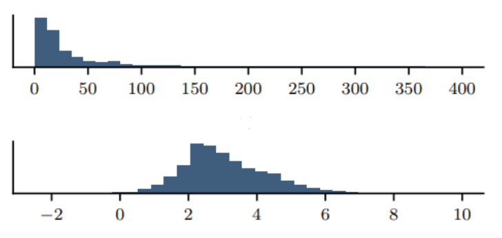
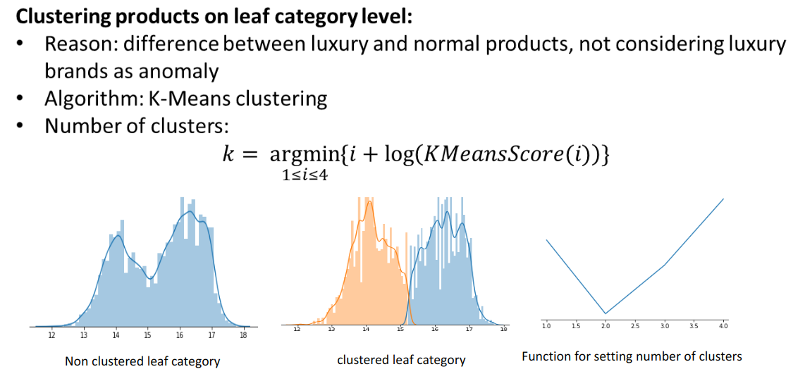
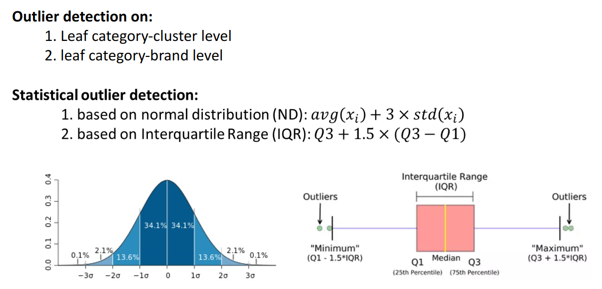

# price-anomaly-detection-model
a price anomaly detection model for marketplace e-commerce company

### Problem Definition
- Miss-priced items in marketplace platform
- Loss of customer trust (PR issue)
- The spread of expensive prices on social media

### Reasons of this problem
- Overpriced products by sellers
- Adding zeros to the selling prices mistakably

### Price Anomaly Detection Problem
- Products without historical data (new) -> hierarchy data
- Products with historical data -> time series data

## flow of price anomaly detection model
1. Creating a data pipeline for extracting the following data from database and inserting to HDFS (partitioned parquet):
Product info: product_id, variant_id, product_title, brand, category_tree
Price: Selling_price, RRP price (actual price withpout discount)
2. Select data from HDFS with Clickhouse view and Filter out product prices with more than 30 days and filter out products which have printed price
3. Apply RegEx on product title to extract number of items in each variant_id
4. Calculate logarithm of RRP price in order to normalize the price distribution and make the model insensitive on higher prices
5. Clustering all products within each leaf category in order to differentiate between normal and luxury products
6. Calculate 4 statistical feature
7. Calculate maximum approved price per leaf category (based on pricing agents’ feedback)
8. Calculate outlier Possibility feature
9. Share products with high possibilities in a PowerBI Dashboard

### Modeling Problems:
1. Rule based anomaly detection for historical products
2. Number of items in each DKPC
3. Luxury products exclusion problem 
### Technical Problems:
1. Memory error while running DBSCAN for finding anomalies
2. Storage and data processing problems
